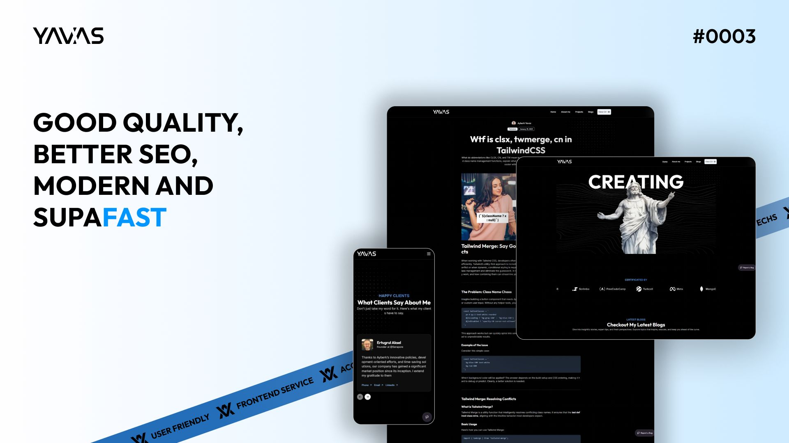
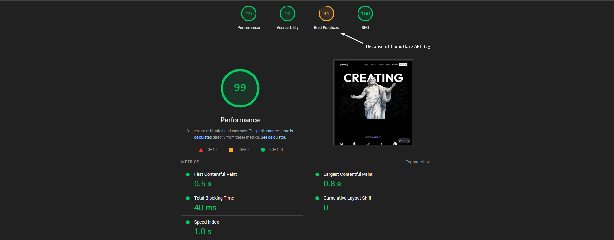

# Ayberk Yavas - v3



This project is the third personal portfolio website of Ayberk Yavaş, built from scratch using modern technologies.
Contact me: contact@ayberkyavas.com

## Features

- **Next.js 15 (Canary Release)**: Cutting-edge features and performance enhancements
- **React 19**: Modern and powerful component-based architecture
- **TypeScript**: Reliable and scalable code structure
- **Framer Motion**: Smooth animations and dynamic transitions
- **Tailwind CSS**: Flexible and customizable design
- **Sanity CMS**: Advanced content management
- **Markdown Support**: Flexible content formatting
- **Advanced Rendering Strategies**:
  - **Partial Prerendering**: Hybrid static and dynamic content
  - **Incremental Static Regeneration (ISR)**: Dynamic page updates
  - **Static Site Generation (SSG)**: Faster page load times
  - **Dynamic Rendering**: Optimized for real-time data processing
  - **Server-Side Rendering (SSR)**: Ensures the most up-to-date content for users

## Application Structure

```text
└── 📁app
    └── 📁(root)
        └── 📁about
            └── page.tsx
        └── 📁blogs
            └── 📁[slug]
                └── page.tsx
            └── page.tsx
        └── layout.tsx
        └── page.tsx
        └── 📁projects
            └── page.tsx
    └── 📁studio
        └── 📁[[...tool]]
            └── layout.tsx
            └── page.tsx
    └── apple-icon.png
    └── favicon.ico
    └── global-error.tsx
    └── globals.css
    └── icon.png
    └── icon.svg
    └── layout.tsx
    └── loading.tsx
    └── manifest.json
    └── opengraph-image.png
    └── robots.ts
    └── sitemap.ts
    └── twitter-image.png
```

## Installation

Follow these steps to run the project locally:

1. Clone the repository:

   ```sh
   git clone https://github.com/Ayberkyvs/ayberkyavas-v3.git
   ```

2. Navigate to the project directory:

   ```sh
   cd ayberkyavas-v3
   ```

3. Install dependencies:

   ```sh
   pnpm install
   ```

4. Start the development server:

   ```sh
   pnpm run dev
   ```

## Technologies Used

- **Next.js 15 (Canary Release)**
- **React 19**
- **TypeScript**
- **Tailwind CSS**
- **Framer Motion**
- **Sanity CMS**
- **Markdown**

## Performance & Speed Metrics


> The image above showcases the website's performance and speed metrics.

## Contributing

If you’d like to contribute, please create an issue before opening a pull request.

## License

This project is licensed under the **Custom MIT License**. Anyone using the code or content must provide proper credit to Ayberk Yavaş or original repository.

## Environment Variables

To run this project locally, you need to set up the following environment variables:

**Sanity CMS:**

- ```NEXT_PUBLIC_SANITY_PROJECT_ID```: Your Sanity project ID.
- ```NEXT_PUBLIC_SANITY_DATASET:``` Your Sanity dataset (e.g., "production").

**Sentry:**

- ```SENTRY_AUTH_TOKEN:``` Your Sentry authentication token to track errors.
  
**Node Environment:**

- ```NODE_ENV:``` Specify the environment (development or production).

**Example ```.env.local``` file:**

```js
NEXT_PUBLIC_SANITY_PROJECT_ID=your-sanity-project-id
NEXT_PUBLIC_SANITY_DATASET=your-sanity-dataset
SENTRY_AUTH_TOKEN=your-sentry-auth-token
NODE_ENV=development
```

## Links

- **Live Demo**: [ayberkyavas.com](https://ayberkyavas.com)
- **GitHub Repository**: [ayberkyavas-v3](https://github.com/Ayberkyvs/ayberkyavas-v3)

For more details, check out the repository.
